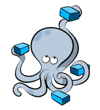

<div style="display: flex; justify-content: center;">
     
    
</div>

# 이 저장소는 [Ollama](https://github.com/ollama/ollama)를 docker compose 환경에서 제어 하기 위한 프로젝트 입니다

- [container 실행](#container-실행)
- [container 제거](#container-제거)
- [모델 추가](#모델-추가)
- [모델 제거](#모델-제거)

## 사용 방법
모델을 로컬 폴더에 bind 합니다 

### container 실행
컨테이너를 실행하려면 다음 커맨드를 실행

```bash
docker compose up -d 
```

### container 제거

docker의 volume 기능을 사용하려면 다음 커맨드를 사용하십시오
```bash
docker compose -f docker-compose-volume.yaml up
```

컨테이너를 제거하려면 다음 커맨드를 사용하십시오
```bash
docker compose down -d 
```

볼륨을 사용할경우 볼륨이 남아있기에 다음을 사용하면 볼륨을 포함하여 제거 가능

* warnning: 볼륨에 저장된 모델이 제거됩니다
```bash
# docker compose -f docker-compose-volume.yaml down --volume
```

## 모델 추가 
docker compose 명령을 사용하여 모델을 다운로드 합니다

기존 ollama 명령을 그대로 사용가능합니다 

### llama3.2:1b 모델을 설치
```bash
docker compose exec server ollama run llama3.2:1b
```

## 모델 제거

### llama3.2:1b 모델을 제거
```bash
docker compose exec server ollama rm llama3.2:1b
```
